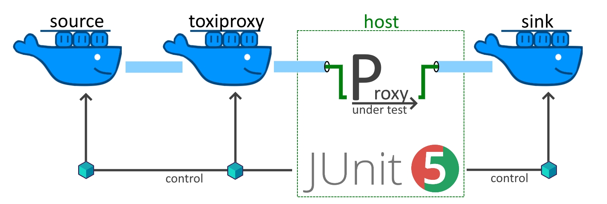

# Testcontainers for Network Testing #

Demo project for the Worldline Techblog article [Testcontainers - Automated Network Testing](https://blog.worldline.tech/2023/08/30/testcontainers-for-network-testing.html).

## Setup ##
The tests require Docker to execute but are otherwise self-contained. To get things running the `DOCKER_CONNECT_STRING`
 in the class DockerTestBase must be adopted to the operating system. The default assumes a Windows environment with
 Docker installed and setup by Rancher (what matters though is that Docker is exposed as NPIPE).
 
## Tests ##

The included tests demonstrate how a application can be tested against typical network issues like high latency, low bandwidth,
sudden connection drops ... The focus is on setting up the communication between host, containers and toxiproxy, not the actual
testing (-:

### BaselineTests ###

showcase how to setup connectivity with testContainers, read the blogpost for more details:

| test                                 | client | server | proxy app | toxiproxy | why                 |
|--------------------------------------|--------|--------|-----------|-----------|---------------------|
| testContainers                       | simple | simple |     -     |     -     | baseline works      |
| testContainersViaLocalHost           | simple | simple |     ✓     |     -     | integrate the host  |
| testStreamingContainers              | stream | stream |     -     |     -     | streaming works     |
| testStreamingContainersWithToxiProxy | stream | stream |     -     |     ✓     | integrate toxiproxy |
| testStreamingFullExample             | stream | stream |     ✓     |     ✓     | everything together |
